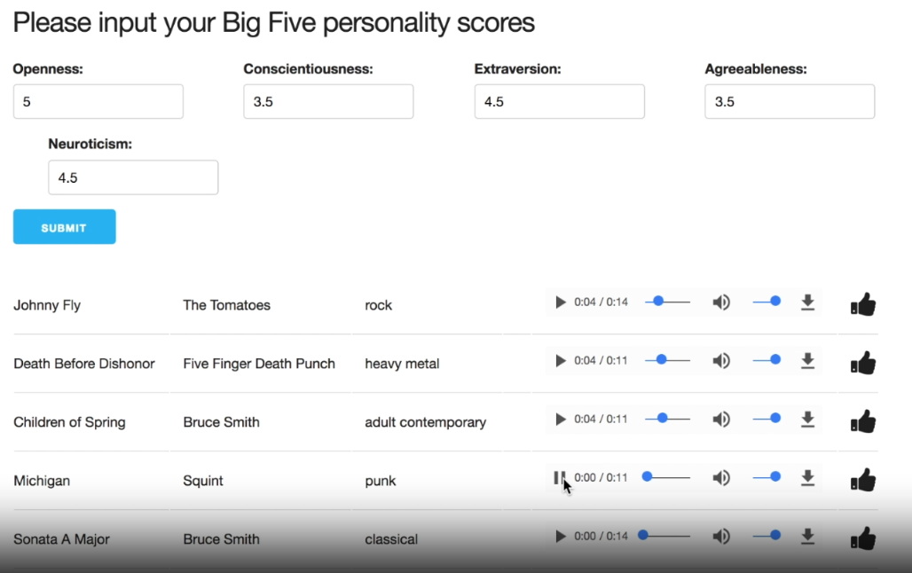
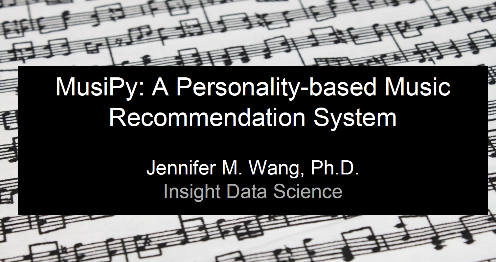

# 🎧 MusiPy By Jenn Wang

## Personality-based Music Recommendation System
- This music recommendation system is based on REAL psychometrically validated personality measures, not some fluffy woo-woo astrological Buzzfeed quiz stuff! 🔮🤓

- This simple project was inspired by empirical research demonstrating the links between personality dimensions and music preferences. I created this app based on _collaborative filtering_ + _content-based filtering_ using **kNN** and **cosine similarities**. Specifically, this app recommends different types of music to users based on their:
  - Unique personality dimensions (as validated by the psychometrically valid **Big Five Inventory**) and
  - Real-time in-app user interactions and behaviors (e.g., 👍🏻 or 👎🏻 to a sample song snippet).

---
## 🚀 Quick Demo: 

---
## 🎤 Presentation: 
- [View Presentation (PDF)](https://github.com/wangjenn/musipy_by_jennwang/files/7940068/Public_Copy_Wang_Jennifer_MusiPy.pdf)

---

## ❓Common FAQs:
- **Why did you use kNN?**
  - Because it is the most commonly used algorithm (the standard algorithm, if you will) for recommendation systems (as of 7 years ago when I first started this project). Also, I didn't have a lot of features in this particular dataset, so I was hoping that the potential problems of overfitting for kNN would be minimal. 

- **Why did you use cosine similarity?**
  - First, *cosine similarity* is a distance metric. Specifically, by measuring the **angle** between the vectors, we can get a good idea of the similarity between items. The smaller the angle, the bigger (closer to 1) the cosine value is, which is indicative of a closer similarity.
  
  - I chose *cosine similarity* because it is the most commonly used distance metric, and also because the nature of my data are not "real" metric values (e.g., length, height, weight), so my thinking at the time was that distance metrics like the Euclidean metrics wouldn't be as appropriate for my particular goals. 

- **How exactly did you use cosine similarity in your project?**
  - The quick answer is that I used cosine similarity for the **personality scores** (the "content-based filtering" portion). Specifically, I used the DISTANCE between the personality scores to calculate this. I also used cosine similarity for determining song rating similarity (the "collaborative-filtering" portion, if you will).
---

## 📚 Resources: 
- Big Five Inventory (BFI): https://openpsychometrics.org/tests/IPIP-BFFM/
